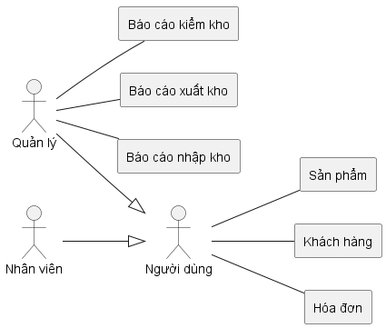
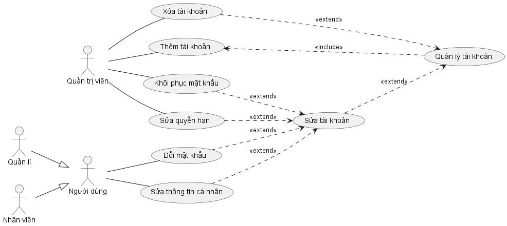
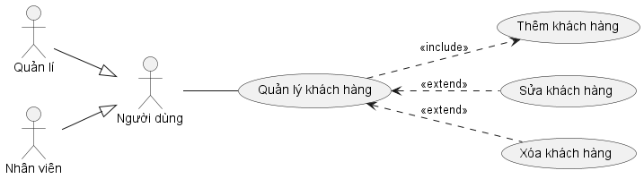
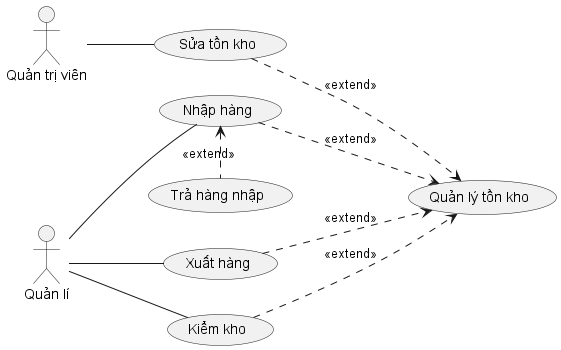
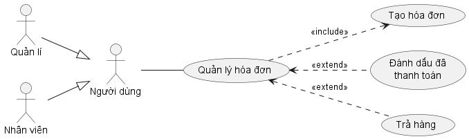
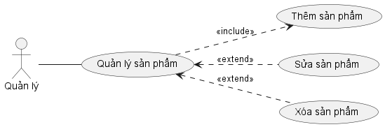

# Phân tích thiết kế

## Tổng quan chức năng

### Biểu đồ Use-case tổng quát

### Các biểu đồ Use-case phân rã

1. Quản lý tài khoản

   

1. Quản lý khách hàng

   

1. Quản lý tồn kho

   

1. Quản lý hóa đơn

   

1. Quản lý sản phẩm

   
