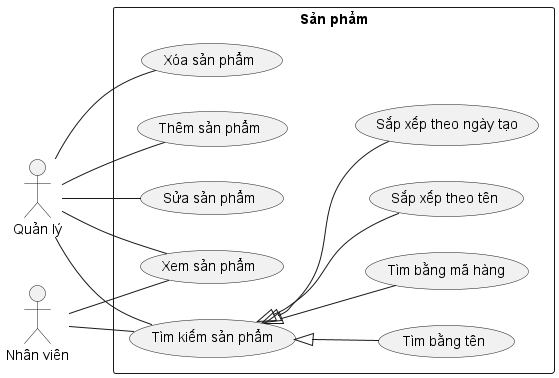
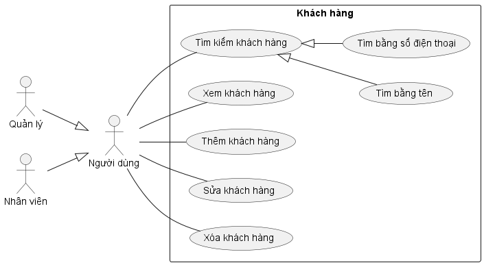
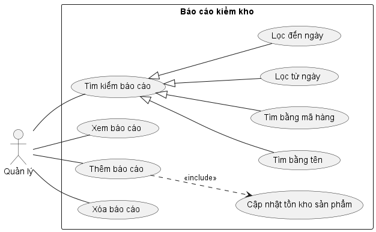
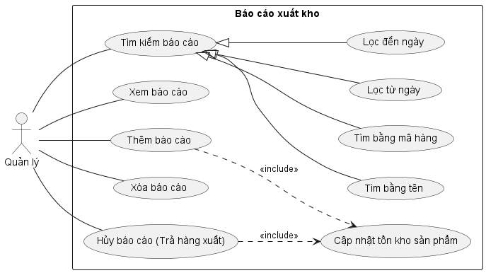
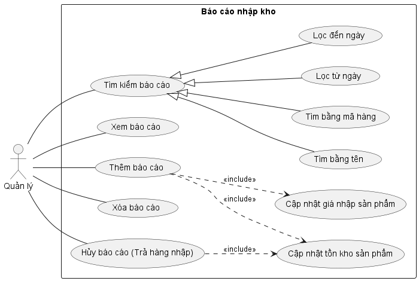
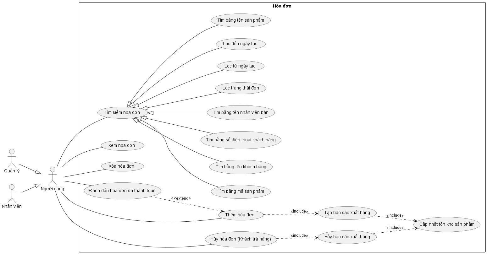

# Phân tích thiết kế

## Tổng quan chức năng

### Biểu đồ Use-case tổng quát

### Các biểu đồ Use-case phân rã

1. Sản phẩm

   

1. Khách hàng

   

1. Báo cáo kiểm kho

   

1. Báo cáo xuất kho

   

1. Báo cáo nhập kho

   

1. Hóa đơn

   
